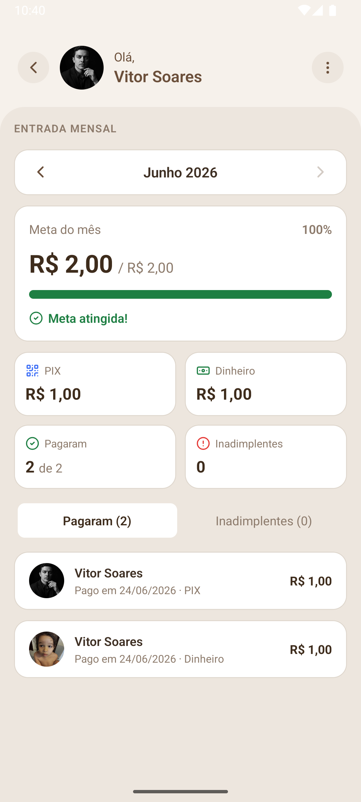
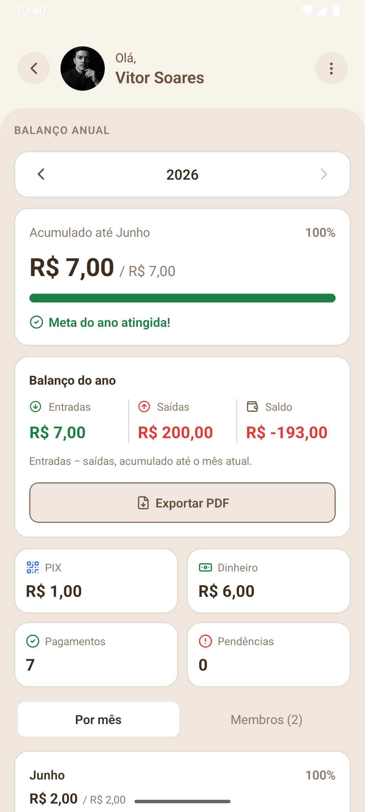
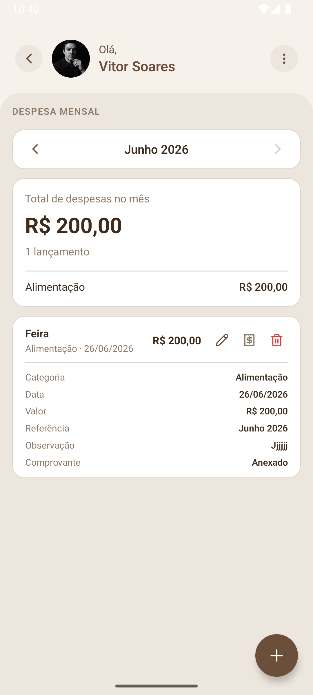
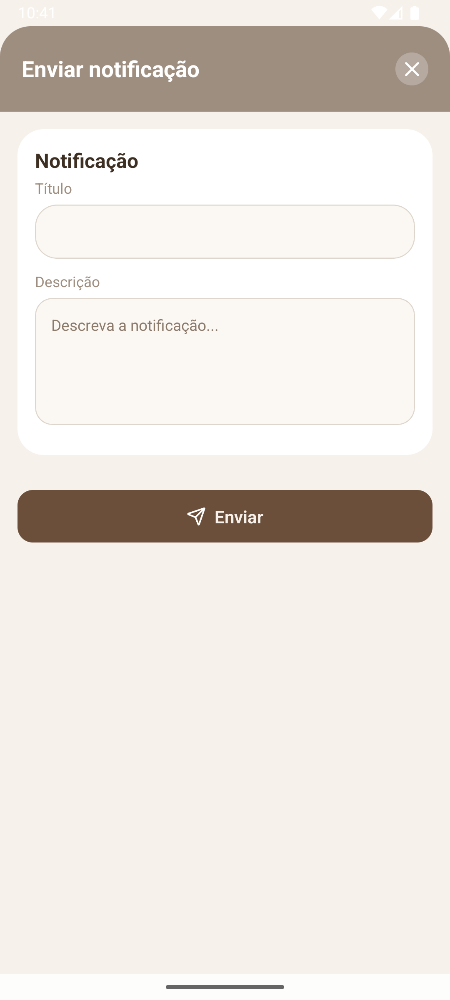

# Resgatar

Mobile application for the Resgatar Community, providing daily Catholic liturgical readings and contribution management for community members.

---

## Table of Contents

- [Overview](#overview)
- [Features](#features)
- [Screenshots](#screenshots)
- [Tech Stack](#tech-stack)
- [Project Structure](#project-structure)
- [Getting Started](#getting-started)
- [Environment Variables](#environment-variables)
- [Development Build](#development-build)
- [Production Build](#production-build)
- [Architecture](#architecture)

---

## Overview

Resgatar is a React Native application built with Expo that serves the members of the Resgatar Catholic community. The app provides access to daily liturgical readings fetched from an external API (for any chosen day via an in-app calendar), contribution tracking with PIX payment integration, a community video feed powered by YouTube, push notifications, member birthday reminders, a light/dark theme, a first-launch onboarding tour with an interactive guided walkthrough, and a full suite of administrative and financial-management tools for community managers — monthly collections, monthly expenses with receipt storage, and an annual balance with PDF export.

---

## Features

**For all members**

- Daily Catholic liturgical readings (First Reading, Psalm, Second Reading, Gospel, Prayer of the Day)
- In-app calendar — browse the liturgy of **any** day, not only today (`getByDate` / `getToday`)
- Liturgical season banner with dynamic color based on the current liturgical period
- Community goal card on the dashboard — live progress toward the month's collective contribution target
- Monthly contribution history with paid and pending status
- PIX payment via QR Code with automatic payment confirmation polling, plus a shareable PIX receipt (PDF)
- Light / dark theme — toggle from the quick-actions sheet; preference persisted on the device
- Birthday reminders — a banner, a quick-actions badge, and a modal listing members celebrating today
- First-launch onboarding tour and an interactive, step-by-step guided walkthrough of the app
- Profile management with personal data editing and password update
- Profile photo — upload and update a personal avatar via camera or gallery; displayed across the entire app
- Delete account — members can permanently remove their own account (password-confirmed)
- Community video feed — browse YouTube videos shared by members; full-screen player via `react-native-youtube-iframe`
- Share videos — members can add videos by pasting a YouTube URL with an optional title
- Push notification support for contribution reminders
- Self-registration — new members can create their own account directly from the login screen via a public API endpoint (no authentication token required)

**For administrators**

Administrators get a dedicated **Settings** tab organized into _Financeiro_ and _Administração_ sections.

_Financial management_

- **Entrada mensal (monthly collection)** — per-month view of who paid, who is overdue, total collected, and how much is left to reach the goal
- **Register cash payment** — manually mark another member's monthly contribution as paid in cash (`pix` / `cash` payment methods)
- **Despesa mensal (monthly expenses)** — register, edit and remove cash-outflow expenses by category (Manutenção, Evento, Material, Alimentação, Doação, Contas/Utilidades, Transporte, Outros)
- **Expense receipts** — attach a receipt image to an expense; stored in S3 via presigned URLs and viewed through a temporary signed link
- **Balanço anual (annual balance)** — year-end close-out cross-referencing income vs. expenses, month by month and per member, with **PDF export** (theme-aware) for sharing

_Community administration_

- **Member management** — remove members, manage admin permissions/roles, update member data, and reset member passwords
- Send push notifications to all members
- Remove videos — administrators can delete any video from the community feed

---

## Tech Stack

| Layer            | Technology                                       |
| ---------------- | ------------------------------------------------ |
| Framework        | React Native 0.81.5 + Expo SDK 54                |
| Language         | TypeScript (strict mode)                         |
| State management | React Context API                                |
| Authentication   | AWS Amplify v6 + Amazon Cognito                  |
| HTTP client      | Axios with Bearer token interceptor              |
| Animations       | React Native Reanimated v4                       |
| Gestures         | react-native-gesture-handler (swipeable tabs)    |
| Forms            | Formik + Yup                                     |
| Navigation       | React Navigation v7 (Bottom Tabs + Native Stack) |
| Theming          | Custom ThemeContext (light/dark) + AsyncStorage  |
| Icons            | Lucide React Native                              |
| QR Code          | react-native-qrcode-svg                          |
| Video player     | react-native-youtube-iframe                      |
| Image picker     | expo-image-picker                                |
| PDF / sharing    | expo-print + expo-sharing (balance & PIX receipts)|
| Receipt storage  | Amazon S3 via presigned URLs                      |
| Notifications    | expo-notifications                               |
| Local storage    | @react-native-async-storage/async-storage        |
| Build service    | EAS Build (Expo Application Services)            |
| Liturgy API      | liturgia.up.railway.app                          |

---

## Project Structure

```
src/
  components/          # Reusable UI components
    Button/
    Input/
    TextArea/
    DocTypeToggle/     # CPF / CNPJ segmented toggle (shared across forms)
    Header/
    Avatar/
    Card/
    Row/
    IconButton/
    ItemActionList/    # Settings/menu row (icon + title + description)
    SectionDivider/
    LiturgySeasonBanner/
    DateNavigator/     # Prev/next day arrows on the dashboard
    CalendarModal/     # Pick the liturgy of any day
    ReadingCard/
    PsalmCard/
    CommunityGoalCard/ # Live monthly goal progress on the dashboard
    ContributionItem/
    ProfileHeaderCard/
    SettingsMemberCard/
    BirthdayBanner/    # Birthday surfaces
    BirthdayFAB/
    BirthdayModal/
    QuickActionsSheet/ # FAB sheet: theme toggle + today's birthdays
    CoachOverlay/      # Interactive guided-tour overlay
    CoachTarget/       # Wraps a target so the tour can spotlight it
    ModalBase/
    ModalPhotoPicker/
    Dialog/
    Toast/
    SwipeableTab/      # Swipe between bottom tabs (gesture-handler)
    BottonTabs/        # Bottom-tab navigator (admin gets the Settings tab)
    TabBar/
    DevModeGuard/
    Skeleton/
      LiturgySkeleton/
      RemoveMemberSkeleton/
      CommunityGoalCardSkeleton/
      MemberListWithSkeleton/
    Svg/
      Logo/
  screens/
    OnboardingScreen/  # First-launch intro slides (shown once)
    LoginScreen/       # Email + password login; link to RegisterScreen
    RegisterScreen/    # Public self-registration (Formik + Yup)
    DashboardScreen/   # Daily liturgy + calendar + community goal
    BillsScreen/
      PixPaymentModal/
      ModalComprovante/
    ProfileScreen/
      ModalEditProfile/
      ModalUpdatePassword/
      ModalEditPhoto/    # Avatar picker (camera / gallery) → base64 upload
      ModalDeleteAccount/
    PersonalSettingsScreen/ # Edit profile, change password, delete account
    SettingsScreen/    # Admin only — Financeiro + Administração sections
      ModalSendNotification/
      ModalRegisterCashPayment/  # Mark a member's contribution paid in cash
      ModalEditMemberData/       # Edit member + toggle admin role
      ModalRemoveMember/
      ModalChangePasswordMember/
    ArrecadacaoScreen/ # Admin — monthly collection (paid / overdue / total / goal)
    ExpensesScreen/    # Admin — monthly expenses by category
      ModalExpenseForm/  # Create/edit expense + attach receipt
    BalancoAnualScreen/# Admin — annual balance (income vs expenses) + PDF export
    MemberActionsScreen/ # Admin — member-management action hub
    VideosScreen/      # Community YouTube feed (+ add / remove modals)
    LoadingScreen/
  services/
    api.ts             # Authenticated Axios instance (Bearer token interceptor)
                       # + publicApi instance (no auth — used for registration)
    MemberService.ts   # CRUD, role, photo, password, birthdays
    ChargeService.ts   # Charges, summaries, cash payment, goal progress
    ExpenseService.ts  # Expenses CRUD + S3 receipt upload/view (presigned URLs)
    BalanceService.ts  # Annual balance (income vs expenses)
    LiturgyService.ts  # getToday + getByDate
    NotificationService.ts
    VideoService.ts    # listAllVideos, createVideo, removeVideo
  context/
    AuthContext.tsx    # login, logout, register, updateMember, deleteAccount,
                       # onboarding state, …
    ChargeContext.tsx
    ThemeContext.tsx   # light/dark mode, persisted via AsyncStorage
    BirthdayContext.tsx# Today's birthday count
    CoachContext.tsx   # Guided-tour steps + orchestration
  navigation/
    AppNavigator.tsx   # Login/Register (unauthenticated) / Onboarding / Home
    navigationRef.ts   # Imperative navigation (used by the guided tour)
    types.ts           # RootStackParamList
  config/
    amplify.ts
    env.ts
  hooks/
    useMaskedField.ts  # useMaskedFieldFromFormik helper
    useCepLookup.ts
  storage/             # AsyncStorage helpers (onboarding flag, …)
  theme/
    index.ts
  types/
    Member/
    Charge/
    Expense/
    Balance/
    Liturgy/
    Notification/
    Video/
  utils/
    helper.ts          # formatMoneyBRL, formatDateFromTimestamp, …
    mask.ts            # Masks + validators: CPF, CNPJ, phone, CEP, currency,
                       # date, validateEmailDomain (disposable domain blocklist)
    apiError.ts
    image.ts
    generateBalanceReport.ts  # Builds + shares the annual-balance PDF
    generatePixReceipt.ts     # Builds + shares the PIX payment receipt PDF
assets/
  images/
    icon.png                    # App icon (1024×1024, RGBA)
    icon-transparent-1024.png   # Logo on transparent bg — used for splash
    notification-icon.png       # White-on-transparent monochrome — Android notifications
    android-icon-foreground.png # Adaptive icon foreground
scripts/
  generate-env.js      # EAS build hook — generates .env from EAS secrets
docs/
  screenshots/
```

---

## Demo

<video src="docs/screenshots/movie.mp4" controls width="320"></video>

---

## Screenshots

### For all members

<table>
  <tr>
    <td align="center" width="33%">
      <br/>
      <sub><b>Dashboard</b><br/>Daily liturgy + community goal card</sub>
    </td>
    <td align="center" width="33%">
      <br/>
      <sub><b>Contributions</b><br/>Paid / pending months · PIX & receipt</sub>
    </td>
    <td align="center" width="33%">
      <br/>
      <sub><b>Community videos</b><br/>YouTube feed shared by members</sub>
    </td>
  </tr>
  <tr>
    <td align="center" width="33%">
      <br/>
      <sub><b>Profile ("Mais")</b><br/>Personal settings, videos, tutorial</sub>
    </td>
    <td align="center" width="33%">
      <br/>
      <sub><b>Personal settings</b><br/>Data, password, delete account</sub>
    </td>
    <td align="center" width="33%">
      <br/>
      <sub><b>Profile photo</b><br/>Camera / gallery avatar picker</sub>
    </td>
  </tr>
  <tr>
    <td align="center" width="33%">
      <br/>
      <sub><b>Dark mode</b><br/>Light / dark theme (persisted)</sub>
    </td>
    <td align="center" width="33%">
      <br/>
      <sub><b>Birthdays</b><br/>Members celebrating today</sub>
    </td>
    <td align="center" width="33%"></td>
  </tr>
</table>

### For administrators

<table>
  <tr>
    <td align="center" width="33%">
      <br/>
      <sub><b>Admin home</b><br/>Financeiro + Administração sections</sub>
    </td>
    <td align="center" width="33%">
      <br/>
      <sub><b>Entrada mensal</b><br/>Paid / overdue · total vs. goal</sub>
    </td>
    <td align="center" width="33%">
      <br/>
      <sub><b>Balanço anual</b><br/>Income vs. expenses + PDF export</sub>
    </td>
  </tr>
  <tr>
    <td align="center" width="33%">
      <br/>
      <sub><b>Despesa mensal</b><br/>Expenses by category + receipt</sub>
    </td>
    <td align="center" width="33%">
      <br/>
      <sub><b>Gestão de membros</b><br/>Remove, roles, cash payment, password</sub>
    </td>
    <td align="center" width="33%">
      <br/>
      <sub><b>Enviar notificação</b><br/>Push a message to all members</sub>
    </td>
  </tr>
</table>

---

## Getting Started

### Prerequisites

- Node.js 18 or later
- Expo CLI: `npm install -g expo-cli`
- EAS CLI: `npm install -g eas-cli`
- Android Studio (for Android emulator) or a physical device

### Installation

```bash
git clone https://github.com/vitorsoftwaredeveloper/resgatar_app.git
cd resgatar_app
npm install
```

### Configure environment variables

```bash
cp .env.example .env
```

---

## Environment Variables

| Variable                      | Description                                         |
| ----------------------------- | --------------------------------------------------- |
| `COGNITO_USER_POOL_ID`        | Amazon Cognito User Pool ID                         |
| `COGNITO_USER_POOL_CLIENT_ID` | Cognito App Client ID                               |
| `COGNITO_REGION`              | AWS region (e.g. `us-east-1`)                       |
| `API_BASE_URL`                | Base URL of the backend REST API                    |
| `API_BASE_URL_AUTH`           | Base URL for authentication endpoints               |
| `NODE_ENV`                    | Runtime environment (`development` or `production`) |

For EAS builds, register variables via the EAS CLI:

```bash
eas env:create --environment production --name COGNITO_USER_POOL_ID --value "<value>" --visibility sensitive
eas env:create --environment production --name COGNITO_USER_POOL_CLIENT_ID --value "<value>" --visibility sensitive
eas env:create --environment production --name COGNITO_REGION --value "us-east-1" --visibility plaintext
eas env:create --environment production --name API_BASE_URL --value "<value>" --visibility sensitive
eas env:create --environment production --name API_BASE_URL_AUTH --value "<value>" --visibility sensitive
```

The `scripts/generate-env.js` hook runs automatically after `npm install` during every EAS build and writes the `.env` file from the registered variables. If any required variable is missing, the build fails immediately with a descriptive error.

---

## Development Build

```bash
# Start Metro bundler
npx expo start

# Run on Android (requires connected device or emulator)
npx expo run:android

# Run on iOS
npx expo run:ios
```

> **After changing `app.config.js` plugins** (splash, notifications, icons), run a clean prebuild before running the app:
>
> ```bash
> npx expo prebuild --clean --platform android
> npx expo run:android
> ```

---

## Production Build

```bash
# Android (.aab for Google Play)
eas build --platform android --profile production

# iOS
eas build --platform ios --profile production
```

### Incrementing the version code

```bash
eas build:version:set --platform android
```

---

## Architecture

### Authentication & Registration flow

```
Unauthenticated
  LoginScreen
    └─ "Registre-se" → RegisterScreen
         └─ publicApi POST /members        (no token — open endpoint)
         └─ on success → back to LoginScreen

  LoginScreen → Amplify signIn (USER_PASSWORD_AUTH)
    └─ on success → MemberService.getMember (authenticated api)
         └─ member stored in Context + AsyncStorage
```

- `api` — authenticated Axios instance; attaches Cognito `idToken` via request interceptor.
- `publicApi` — plain Axios instance with no interceptor; used exclusively for self-registration so unauthenticated users can call the backend without a token.

### Navigation

```
AppNavigator (Stack)
  ├─ LoginScreen        (unauthenticated)
  ├─ RegisterScreen     (unauthenticated)
  ├─ Onboarding         (authenticated, first launch only)
  └─ Home → BottomTabs  (authenticated)
       │    ├─ DashboardScreen
       │    ├─ BillsScreen
       │    ├─ SettingsScreen   (admin role only)
       │    └─ ProfileScreen
       │
       │  Stack screens pushed over Home:
       ├─ Videos             (community video feed)
       ├─ PersonalSettings   (edit profile / password / delete account)
       ├─ Arrecadacao        (admin — monthly collection)
       ├─ Expenses           (admin — monthly expenses)
       ├─ BalancoAnual       (admin — annual balance + PDF)
       └─ MemberActions      (admin — member management)
```

The bottom tabs are swipeable (`SwipeableTab` + `react-native-gesture-handler`). The **Settings** tab is only mounted for members whose `role === "admin"`.

### Profile photo

Members can update their avatar from `ProfileScreen → ModalEditPhoto`. The photo is picked via `expo-image-picker` (camera or gallery), resized and converted to base64, then sent to the backend via `MemberService`. The resulting base64 string is stored in the `profileImage` field of the member object and rendered by the `Avatar` component throughout the app. A generic fallback icon is shown when no photo is set.

> `expo-image-picker` requires the `CAMERA` and `MEDIA_LIBRARY` permissions. To avoid the `RECORD_AUDIO` permission (which reduces device support on Google Play), set `microphonePermission: false` and add a `uses-feature` element with `required="false"` in `app.config.js`.

### Community video feed

`VideosScreen` shows a paginated list of YouTube videos shared by members. Each card renders the video thumbnail, title, and author.

- **Add video** — any member can open `ModalAddVideo`, paste a YouTube URL, and optionally provide a title. The URL is sent to `VideoService.createVideo`.
- **Full-screen player** — tapping a card opens `ModalVideoFeed` with an embedded `react-native-youtube-iframe` player.
- **Remove video** — admins see a delete button on each card that calls `VideoService.removeVideo`.

`VideoService` wraps three REST endpoints: `GET /videos`, `POST /videos`, and `DELETE /videos/:id`.

### Financial management (admin)

The admin **Settings** tab groups all money-related tools, backed by three services:

- **`ArrecadacaoScreen` (Entrada mensal)** — per-month collection view: paid members, overdue members, total collected, and goal gap. Admins can register a member's payment as cash via `ModalRegisterCashPayment` → `ChargeService.registerCashPayment`. Each contribution carries a `paymentMethod` of `pix` or `cash`.
- **`ExpensesScreen` (Despesa mensal)** — monthly cash-outflow ledger. `ExpenseService` wraps `POST/GET/PUT/DELETE /expenses` plus `GET /expenses/summary` (total + per-category breakdown). Expenses use a **0-indexed** `referenceMonth` (0 = January) — pass `Date.getMonth()` directly. Categories are a fixed enum mirrored from the backend.
- **`BalancoAnualScreen` (Balanço anual)** — cross-references effective income (collections) against expenses to produce per-month result and accumulated balance, year-to-date, via `BalanceService.getAnnual`. A theme-aware PDF is generated with `expo-print` and shared with `expo-sharing` (`utils/generateBalanceReport.ts`).

> **Month indexing caveat.** Charge endpoints use `1–12` for months, while expense and balance endpoints use `0–11`. The service comments call this out at each call site — keep them in sync when adding endpoints.

#### Expense receipts (S3 presigned URLs)

Receipt images never pass through the API. Upload is a two-step, presigned-URL flow:

1. `GET /expenses/receipt-upload-url?contentType=…` returns `{ uploadUrl, key }`.
2. The binary is `PUT` **directly** to S3 (`uploadUrl`) with a matching `Content-Type` and **no** `Authorization` header (it would invalidate the S3 signature).

Only the returned `key` is persisted on the expense. To view a receipt, `GET /expenses/:id/receipt` returns a short-lived presigned `viewUrl`. On edit, sending `receiptKey: null` removes the existing receipt.

### Theme system (light / dark)

`ThemeContext` exposes `mode` (`"light" | "dark"`), a `colors` palette, and `toggleTheme`. The choice is persisted in AsyncStorage (`@resgatar:theme`) and restored on launch. Components consume colors via `useAppTheme()` rather than importing static tokens, so they re-render on theme change. The theme is toggled from the `QuickActionsSheet` (the dashboard FAB). The static design tokens (`SPACING`, `RADIUS`, `TYPOGRAPHY`, `SHADOW`) still live in `src/theme/index.ts`.

### Onboarding & guided tour

- **Onboarding** — on first launch after login, `OnboardingScreen` shows intro slides. A "seen" flag is stored via the `storage/` helpers (`getOnboardingSeen` / `setOnboardingSeen`); `AuthContext` exposes `needsOnboarding`, `completeOnboarding`, and `restartOnboarding`.
- **Guided tour** — `CoachContext` drives an interactive, step-by-step walkthrough. Each `CoachStep` targets a UI element wrapped in `CoachTarget`; `CoachOverlay` spotlights it and navigates between tabs/screens imperatively through `navigation/navigationRef.ts`. Optional steps are skipped when their target isn't mounted.

### Birthdays

`BirthdayContext` fetches members (`MemberService.listBirthdayMembers`) and computes how many have a birthday today. The count surfaces as a badge in the `QuickActionsSheet` and a banner/FAB, and the full list opens in `BirthdayModal`.

### Forms

All forms use **Formik + Yup**. Masked fields (phone, CPF/CNPJ, currency, CEP, date) are wired via the `useMaskedFieldFromFormik` hook so that both the displayed value and the Formik state stay in sync.

The `DocTypeToggle` component provides a consistent CPF / CNPJ segmented control used in:

- `RegisterScreen`
- `ModalEditProfile`

### Email validation

All email fields validate both format and domain. `validateEmailDomain` in `src/utils/mask.ts` maintains a blocklist of 50+ known disposable and fake domains (`mailinator.com`, `tempmail.com`, `yopmail.com`, `test.com`, `mail.com`, etc.). Emails from these domains are rejected with the message _"Domínio de email não permitido"_.

### Theme system

All visual tokens are centralized in `src/theme/index.ts`. Components consume `COLORS`, `SPACING`, `RADIUS`, `TYPOGRAPHY`, and `SHADOW` from this module.

### Android assets

| Asset                    | File                          | Requirement                                                                                     |
| ------------------------ | ----------------------------- | ----------------------------------------------------------------------------------------------- |
| App icon                 | `icon.png`                    | 1024×1024, RGBA                                                                                 |
| Adaptive icon foreground | `android-icon-foreground.png` | 1024×1024, RGBA, safe zone 66%                                                                  |
| **Notification icon**    | `notification-icon.png`       | White (#FFF) on transparent — Android ignores color and uses only the alpha channel             |
| **Splash logo**          | `icon-transparent-1024.png`   | Brown logo on transparent; `expo-splash-screen` composites it over `backgroundColor: "#F5F0E8"` |

> After updating any asset referenced by an `app.config.js` plugin, run `npx expo prebuild --clean` to regenerate native resource files before building.

### Liturgical colors

| Season                       | Accent  |
| ---------------------------- | ------- |
| Verde (Ordinary Time)        | #2E7D32 |
| Roxo (Advent / Lent)         | #7B1FA2 |
| Branco (Feasts)              | #B8860B |
| Vermelho (Passion / Martyrs) | #C62828 |
| Rosa (Laetare / Gaudete)     | #AD1457 |
